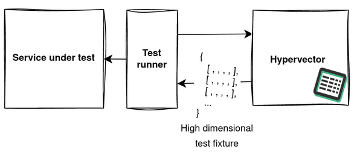
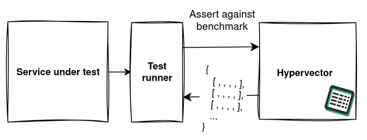

# hypervector


**Status: 🔨 Pre-first release**

Hypervector is a test data fixture engine intended for data-intensive production systems such as those reliant
on machine learning and data science components. It makes configuring & generating high dimensional feature 
vector fixtures for testing easy and repeatable.

## Use



Hypervector naturally sits alongside your integration and smoke test infrastructure
during continuous integration stages, and makes large high-dimensional feature vectors
available via endpoint.



The service allows for benchmarks to be saved alongside feature vectors which can be 
asserted by test runners to provide a sophisticated regression testing framework for
statistical properties of your fixtures.

## Build

You can run the test suite and build a local binary (useful for development) with:

```bash
make all
```

Building and running a Docker image is done with:

```bash
make docker
```
